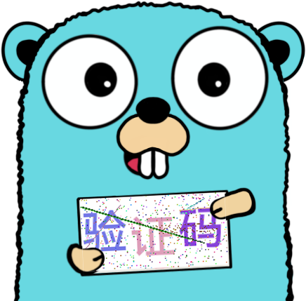

<div align="center">
  <a href="https://github.com/loommii/captcha-image"></a>
  <p><em>验证码图片生成</em></p>
</div>

-----------

# captcha-image
>captcha-image是一个 Go 语言工具函数库，旨在快速生成验证码图片，提供高效且灵活的解决方案。

## 特性
- 依赖 Go 标准库、`golang.org/x` 和 `github.com/golang`。
- 支持自定义字体，满足个性化需求。
- 可设置图片大小，并根据验证码字符数动态调整字体大小，确保最佳显示效果。
- 提供多语言支持，适应不同语言环境。

##  安装
```
go get github.com/loommii/captcha-image/captchaimage
```

##  DEMO
```go
package main

import (
	"image/png"
	"os"

	"github.com/loommii/captcha-image/captchaimage"
)

func main() {

	captcha := captchaimage.NewCaptchaGenerator()
	img, err := captcha.GenerateCaptcha("验证码内容")
	if err != nil {
		panic(err)
	}
	// 保存图像到文件
	outFile, err := os.Create("captcha.png")
	if err != nil {
		panic(err)
	}
	defer outFile.Close()

	// 将图片保存为 PNG 格式
	err = png.Encode(outFile, img)
	if err != nil {
		panic(err)
	}
}
```